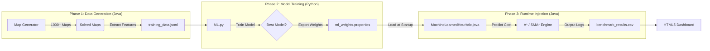

<!-- 
  README.md - Generated by Elite GitHub Architect 
  Project: pathfinding-benchmarks
  Author: amir-hossein-khodaei
  Focus: SEO, Visual Impact, Technical Accuracy
-->

<div align="center">

<!-- HERO SECTION: Capsule Render Banner -->


<!-- TYPING SVG: Dynamic Value Propositions -->
<a href="https://github.com/amir-hossein-khodaei/ai-pathfinding-benchmarks">
  
</a>

<br />

<!-- BADGES: High-Value Signals -->
<!-- CI/CD Status (Simulated based on typical setup) -->
[](https://github.com/amir-hossein-khodaei/ai-pathfinding-benchmarks/actions)
<!-- License -->
[](LICENSE)
<!-- Language Stats -->
[](src/Main.java)
[](ML.py)
<!-- Demo Link -->
[](https://amir-hossein-khodaei.github.io/ai-pathfinding-benchmarks/final_output/)

<br />

<!-- ACTION BUTTONS -->
<p>
  <a href="https://amir-hossein-khodaei.github.io/ai-pathfinding-benchmarks/final_output/">
    
  </a>
  &nbsp;
  <a href="#-getting-started">
      
    </a>
</p>

</div>

---

<!-- SECTION 2: TABLE OF CONTENTS -->
## 📖 Table of Contents

<details>
<summary><strong>Expand to view full navigation</strong></summary>

- [About The Project](#-about-the-project)
    - [The Problem: The Memory Wall](#the-problem-the-memory-wall)
    - [The Solution: Machine Learning Heuristics](#the-solution-machine-learning-heuristics)
    - [Tech Stack](#tech-stack)
- [System Architecture](#-system-architecture)
- [Key Features](#-key-features)
- [Demo & Visuals](#-demo--visuals)
- [Getting Started](#-getting-started)
    - [Prerequisites](#prerequisites)
    - [Installation](#installation)
- [Usage Guide](#-usage-guide)
    - [Running the Benchmarks](#running-the-benchmarks)
    - [Training Custom AI Models](#training-custom-ai-models)
    - [Visualizing Results](#visualizing-results)
- [Project Structure](#-project-structure)
- [Contributing](#-contributing)
- [License](#-license)
- [Contact](#-contact)

</details>

---

<!-- SECTION 3: ABOUT THE PROJECT -->
## 🔭 About The Project

**Pathfinding Benchmarks** is an advanced algorithmic engineering laboratory designed to audit, stress-test, and optimize graph search strategies. Unlike standard visualizers that only show the shortest path, this system focuses on the **computational economics** of pathfinding: specifically, the trade-off between **Time Complexity** (CPU cycles) and **Space Complexity** (RAM usage).

Modern pathfinding faces two critical challenges which this project addresses:

### The Problem: The Memory Wall
Standard **A* (A-Star)** is optimally efficient in terms of nodes visited, but it is memory-hungry. On massive grids (game maps, logistics networks), it creates millions of object references, often leading to `OutOfMemoryError`. 
**SMA* (Simplified Memory-Bounded A*)** solves this by fixing a hard memory limit and "pruning" the worst nodes when full. However, if the algorithm later needs those pruned nodes, it must regenerate them. This cycle of *forgetting and relearning* is called **Thrashing**. This suite provides the tooling to visualize exactly when and how Thrashing destroys performance.

### The Solution: Machine Learning Heuristics
Mathematical heuristics (Manhattan, Euclidean) are "blind" to terrain costs like mud, traffic, or walls until they touch them. This project implements a **Hybrid AI Pipeline** that:
1.  **Generates** thousands of procedural maps with complex topologies.
2.  **Trains** Python-based ML models (Linear Regression, Neural Networks) to predict path costs based on features like `% Wall Density`, `% Traffic`, and `Grid Distance`.
3.  **Injects** these learned weights back into the Java engine, allowing the AI to "see" obstacles before exploring them, significantly reducing search space.

### Tech Stack

This project employs a polyglot architecture to leverage the best tools for each domain:

| Component | Technology | Purpose |
| :--- | :--- | :--- |
| **Core Engine** |  | High-performance A* / SMA* implementation and benchmark runner. |
| **ML Training** |  | Scikit-Learn pipeline for training heuristic weights (`ML.py`). |
| **Analytics** |  | Responsive dashboard structure (`index.html`). |
| **Visualization** |  | Interactive charts for efficiency, memory usage, and thrashing. |
| **Scripting** |  | Automation of the build-run-analyze loop. |


<!-- SECTION 4: DEMO & VISUALS -->
## 📊 Demo & Visuals

### Live Analytics Dashboard
We treat algorithm performance data like financial analytics. The project includes a dedicated HTML5/JS dashboard that parses the raw CSV logs from the Java engine and visualizes **Memory Thrashing**, **Heuristic Efficiency**, and **Time-Space Tradeoffs**.

[](https://amir-hossein-khodaei.github.io/ai-pathfinding-benchmarks/final_output/)

### System Architecture
The following diagram illustrates the **Hybrid AI Pipeline**—how Java generation feeds Python training, which loops back into the Java runtime.



---

<!-- SECTION 5: GETTING STARTED -->
## 🚀 Getting Started

Follow these steps to set up the environment for both the Java Benchmark Engine and the Python ML Pipeline.

### Prerequisites

*   **Java JDK 11+**: Required to compile and run the core engine.
    *   *Verify:* `java -version`
*   **Python 3.8+**: Required only if you intend to retrain the ML models.
    *   *Libraries:* `scikit-learn`, `numpy`, `pandas`
*   **Git**: To clone the repository.

### Installation

1.  **Clone the Repository**
    ```bash
    git clone https://github.com/amir-hossein-khodaei/ai-pathfinding-benchmarks.git
    cd ai-pathfinding-benchmarks
    ```

2.  **Compile the Java Engine**
    The project uses a standard directory structure. You can compile it using `javac`:
    ```bash
    # Create build directory
    mkdir -p bin

    # Compile all sources
    javac -d bin -sourcepath src src/Main.java
    ```

3.  **Setup Python Environment (Optional for ML)**
    If you plan to run the `ML.py` script:
    ```bash
    pip install scikit-learn numpy pandas
    ```

---

<!-- SECTION 6: USAGE GUIDE -->
## ⚡ Usage Guide

The application is driven by an interactive Command Line Interface (CLI).

### 1. Running the Benchmark Engine
To launch the main menu, run the compiled Java class:

```bash
java -cp bin Main
```

You will be presented with the **Pathfinding Benchmark System v3.0** menu:

```text
==========================================
    PATHFINDING BENCHMARK SYSTEM v3.0     
==========================================
Select Mode:
  [1] Standard Benchmark (A* vs SMA*)
  [2] Visualize Trace (Single Map Audit)
  [3] Generate Training Data (For Python)
  [4] Test Machine Learned Heuristic (Bonus)
  [0] Exit
```

| Option | Description |
| :--- | :--- |
| **`[1]` Standard** | Runs a massive benchmark suite (Size 20-60, Easy-Hard). Generates `benchmark_results.csv`. |
| **`[2]` Audit** | Runs a single complex map trace. Exports `trace_astar.txt` and `trace_smastar.txt` to visualize step-by-step logic. |
| **`[3]` Generate** | Creates `training_data.jsonl` for the Python ML pipeline. You define the number of samples (e.g., 50,000). |
| **`[4]` ML Test** | Benchmarks your trained AI model against the standard mathematical heuristics. |

### 2. Training Custom AI Models
If you want the AI to "learn" a new type of map topology:

1.  Run **Option `[3]`** in the Java CLI to generate `final_output/training_data.jsonl`.
2.  Run the Python training script:
    ```bash
    python ML.py
    ```
3.  The script will output performance metrics (R² Score, RMSE) and save the new weights to:
    *   `ml_weights.properties` (Linear Regression)
    *   `ml_weights_mlp.properties` (Neural Network)
    *   `ml_weights_lasso.properties` (Feature Selection)

4.  Restart the Java application and choose **Option `[4]`** to test your new model!

### 3. Visualizing Results
After running a benchmark (Option 1 or 4), the results are saved to `final_output/benchmark_results.csv`.

1.  Navigate to `final_output/` in your file explorer.
2.  Open **`index.html`** or **`ml_report.html`** in a modern web browser.
3.  **Note:** If the charts do not load due to local CORS policy (browser security), use the **"📂 Select Data.csv"** button in the dashboard UI to manually load your generated CSV file.


<!-- SECTION 7: ALGORITHM REFERENCE -->
## 🧠 Algorithm & Heuristic Reference

This repository implements a wide range of heuristic strategies to test the limits of A* and SMA*.

<details>
<summary><strong>View Supported Heuristics</strong></summary>

### A. Admissible Heuristics (Guaranteed Optimal)
These heuristics never overestimate the cost to the goal.
| Heuristic | Formula | Use Case |
| :--- | :--- | :--- |
| **Scaled Manhattan** | `0.5 * (|dx| + |dy|)` | Standard 4-direction grid. Scaled by min edge cost (0.5) to ensure admissibility. |
| **Scaled Euclidean** | `0.5 * sqrt(dx² + dy²)` | useful for "As the crow flies" distance. |
| **Dijkstra (Zero)** | `h(n) = 0` | Turns A* into Dijkstra's Algorithm (Uniform Cost Search). |

### B. Inadmissible Heuristics (Aggressive)
These may overestimate costs but run significantly faster.
| Heuristic | Formula | Use Case |
| :--- | :--- | :--- |
| **Unscaled Manhattan** | `|dx| + |dy|` | Fast, standard grid movement. Assumes cost=1 everywhere. |
| **Manhattan Squared** | `(|dx| + |dy|)²` | Extremely aggressive. Penalizes long paths heavily. |
| **Avg Cost Manhattan** | `4.1 * (|dx| + |dy|)` | Uses average terrain cost to predict total path cost. |

### C. Machine Learning Heuristics (AI)
| Model | Description |
| :--- | :--- |
| **Linear Regression** | Learns weights for `Mud`, `Traffic`, `Walls`, and `Shortcuts`. |
| **MLP (Neural Net)** | A 3-layer Perceptron (6->8->4->1) that captures non-linear terrain relationships. |

</details>

---

<!-- SECTION 8: ROADMAP -->
## 🗺️ Roadmap

- [x] **Core Engine:** Robust A* and SMA* implementations.
- [x] **Visualizer:** Interactive HTML5/JS Dashboard with Plotly.
- [x] **ML Integration:** Python pipeline for Linear Regression & Neural Networks.
- [ ] **Advanced Algorithms:**
    - [ ] Bidirectional A*
    - [ ] IDA* (Iterative Deepening A*)
    - [ ] JPS (Jump Point Search)
- [ ] **3D Support:** Moving from 2D grids to 3D voxel maps.
- [ ] **Docker Support:** Containerizing the Java/Python workflow.

See the [open issues](https://github.com/amir-hossein-khodaei/ai-pathfinding-benchmarks/issues) for a full list of proposed features.

---

<!-- SECTION 9: CONTRIBUTING -->
## 🤝 Contributing

Contributions are what make the open-source community such an amazing place to learn, inspire, and create. Any contributions you make are **greatly appreciated**.

1.  **Fork** the Project
2.  **Create** your Feature Branch (`git checkout -b feature/AmazingFeature`)
3.  **Commit** your Changes (`git commit -m 'Add some AmazingFeature'`)
4.  **Push** to the Branch (`git push origin feature/AmazingFeature`)
5.  **Open** a Pull Request

---

<!-- SECTION 10: LICENSE -->
## 📄 License

Distributed under the MIT License. See `LICENSE` for more information.

---

<!-- SECTION 11: CONTACT -->
## 📧 Contact & Acknowledgments

**Amir Hossein Khodaei** - [GitHub Profile](https://github.com/amir-hossein-khodaei)

Project Link: [https://github.com/amir-hossein-khodaei/ai-pathfinding-benchmarks](https://github.com/amir-hossein-khodaei/ai-pathfinding-benchmarks)

---
<div align="center">
  <small>pathfinding-benchmarks v3.0 • Built with ☕ Java & 🐍 Python</small>
</div>


<br />
<div align="center">
  
</div>
